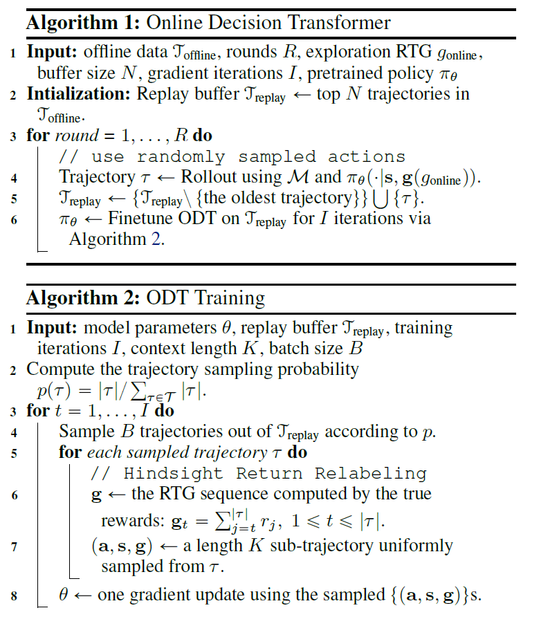

# Reinforcement-Learning-Research
A repository for collaborative research and implementation of cutting-edge reinforcement learning algorithms and techniques

**Decision transformer:**

Checklist:
Para miércoles 11
* Ambiente
* Replay Buffer

* Red 1: Básica
* Red 2: Transformer
* Red 3: RNN (tal vez)

Por Fijar
* Con datos iniciales (offline)
* Solo Online
* Ambos

* Algoritmo 1 pdf
* Algorimto 2 pdf
* Algoritmo 3 pdf

* K hiperparámetro